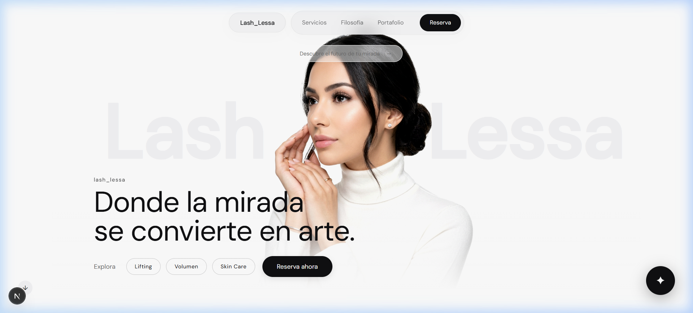
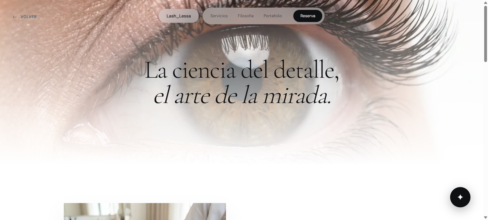
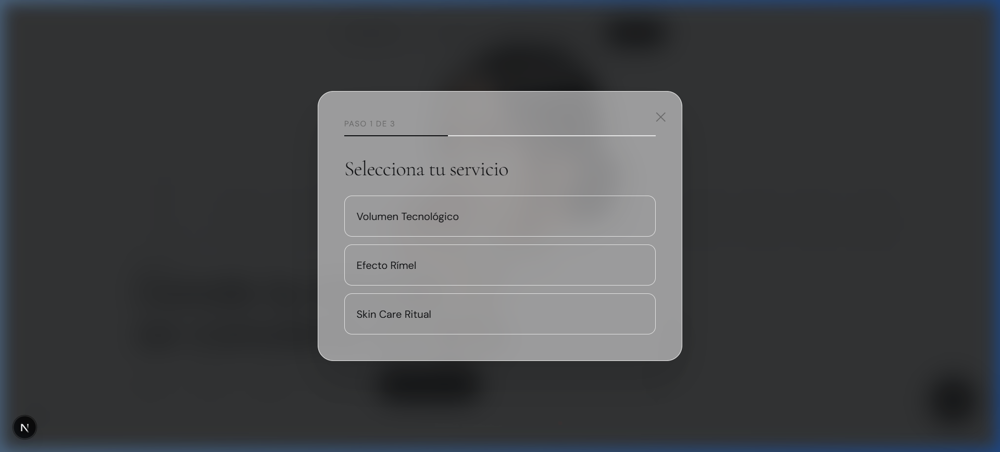
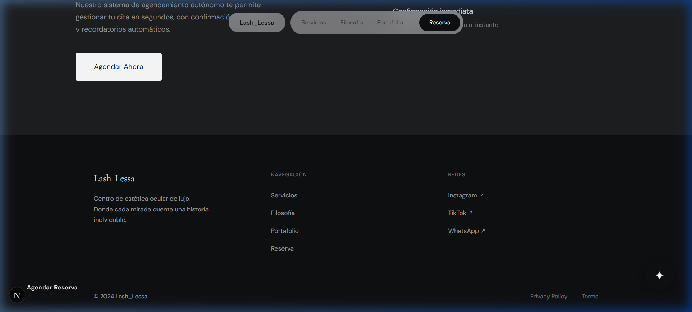

# 🕊️ Lash Lessa — Estética Minimalista & Lujo

Lash Lessa es una plataforma web de alta gama diseñada para una marca de estética premium, donde "la mirada se convierte en arte". El proyecto destaca por su estética **White Silence**, animaciones fluidas y una experiencia de usuario inmersiva.

---

## 📸 Capturas de Pantalla

### 🏠 Home Page


### 🌿 Experiencia & Servicios


### 📅 Sistema de Reserva


### 📞 Contacto & Footer


---

## ✨ Características Principales

- **Diseño Ultra-Minimalista**: Una paleta de colores limpia (White, Gray, Black) que resalta la elegancia de la marca.
- **Animaciones Premium**: Integración avanzada con **GSAP** para transiciones suaves y efectos visuales de alta calidad.
- **Scroll Suave**: Implementación de **Lenis Scroll** para una navegación fluida en toda la página.
- **Sistema de Reservas**: Flujo interactivo de tres pasos para agendar servicios directamente desde la web.
- **Totalmente Responsivo**: Experiencia optimizada para dispositivos móviles, tablets y escritorio.
- **Arquitectura Moderna**: Construido con **Next.js 15** y **Tailwind CSS 4**.

---

## 🛠️ Stack Tecnológico

- **Frontend**: [Next.js 15](https://nextjs.org/) (App Router)
- **Lenguaje**: [TypeScript](https://www.typescriptlang.org/)
- **Estilos**: [Tailwind CSS 4](https://tailwindcss.com/)
- **Animaciones**: [GSAP](https://gsap.com/)
- **Scroll**: [Lenis](https://github.com/darkroomengineering/lenis)
- **Deployment**: [Vercel](https://vercel.com/)

---

## 🚀 Instalación y Desarrollo

1. **Clonar el repositorio:**
   ```bash
   git clone https://github.com/tu-usuario/lash_lessa.git
   cd lash_lessa
   ```

2. **Instalar dependencias:**
   ```bash
   npm install
   ```

3. **Ejecutar el servidor de desarrollo:**
   ```bash
   npm run dev
   ```

4. **Abrir en el navegador:**
   Visita [http://localhost:3000](http://localhost:3000) para ver el resultado.

---

## 📁 Estructura del Proyecto

- `app/`: Rutas y páginas principales de la aplicación.
- `components/`: Componentes UI reutilizables y secciones del sitio.
- `hooks/`: Hooks personalizados para lógica de React.
- `public/`: Archivos estáticos, imágenes y capturas de pantalla.

---

Desarrollado con ❤️ para **Lash Lessa**.

